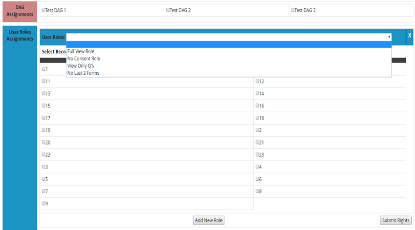

##User Rights by Record Documentation
####Required REDCap project
This external module requires a REDCap project be created to store custom user rights settings on a per user basis. A basic data dictionary for this can be downloaded <a href='https://cdn.jsdelivr.net/gh/vanderbilt-redcap/user-rights-by-record/includes/UserRightsModuleSettings_DataDictionary.csv' download='UserRightsModuleSettings_DataDictionary.csv'>here</a>. This REDCap project can be used for all instances of this External Module on a REDCap installation. No user should go into this REDCap project and modify any of the data present within it. There is a user interface provided with this module that will allow for setting user rights.

For further explanation of the module settings, continue reading.

####Module Settings Explanation
Below is an explanation of the various settings found in the external module, along with their default values if you use the provided data dictionary. 
* **Project Storing User Rights and DAG Assignments:** Project list dropdown to indicate the project storing the custom user rights. The user creating this module's settings must have user rights set on the required project to see it in this dropdown.
* **Field that Stores User Access Information:** This indicates a text field which will be storing the custom access rights defined by this module. (DEFAULT: access)
* **Field that Stores Project for Access Rights:** This indicates a text field which will store the project to which the custom user rights will be applied. (DEFAULT: project_id)
* **Field that Stores User Name to Apply Rights:** A text field which stores the REDCap username of the person the custom right will be applied to. (DEFAULT: user_id)
* **Field that Stores DAG Assignments:** Text field which stores the custom Data Access Group (DAG) assignments for a user. Assigning a user to a DAG through this module will mean they are considered to be in that DAG for all records in the project, you cannot have them considered in a DAG for a subsection of records. (DEFAULT: dag_assign)
* **Field that Identifies User as Part of Custom Group:** The text field which will store which custom user rights group, if any, that the user belongs to. This group is a means for the module to apply the same custom user rights to a group of users instead of one user at a time. (DEFAULT: rights_group)

####Setting user custom rights
#####Single User
User rights can be defined using the provided interface, found in a link the left toolbar of the REDCap project. This link looks as below:
 
Once there, you will find a screen that looks as below: 
 
The list of users in this dropdown is populated by the users with rights on the REDCap project. When a user is selected the "Load User" button will generate a new table. 
 
The 'DAG Assignments' section is a list of checkboxes that represents all Data Access Groups on the project. A user will be treated as being in any of the DAGs selected here, and be treated as such by REDCap on all records. 
The 'User Roles Assignments' section provides a table to assign a REDCap User Role to the user. The User Role is selected from the dropdown menu. The series of checkboxes below this are all the reocrds on the project. Select the checkbox for each record you wish for the user to have the chosen User Role in. Once in place, the user will be treated as being in this User Role by REDCap, overriding any other rights they may have. 
More User Roles may be chosen by clicking the "Add New Role" button. Any User Role may be removed by clicking the white 'X' in the top-right corner. 
Once finished, the "Submit Rights" button will save the chosen settings, and the user will now have those rights when they next view the project. 
#####User Group
Instead of assigning special rights user by user, you can also assign a group of users special rights all at once.
 
The dropdown shown will have a list of already defined groups for this project. There is also a default option of "New Group" which, when selected, will show the text field displayed where you can name your new group. Once a group is chosen, or a new group named, click the 'Load Custom Group' button.
 
As shown above, the table loaded is much like the single user table, but with a list of user currently on the REDCap project displayed with checkboxes. Check all of the users that you wish to be a part of this group, and then set up their DAG and User Rights assignments as you would a single user. 
Once a user is in a group, they can later be assigned their own custom rights using the 'Single User' process. This will cause them to have rights not described by the group.